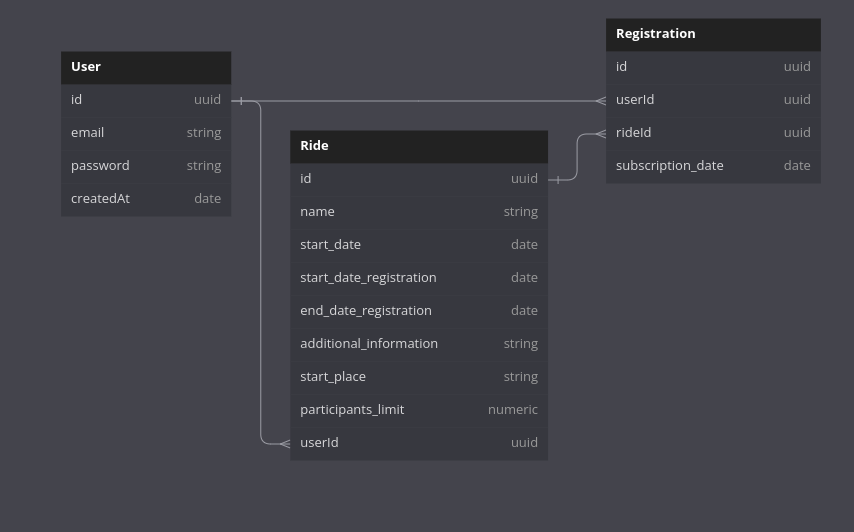

<h1 align="center">
  Bike Rides
</h1>

## 💻 Projeto

Uma API que irá possibilitar a criação de pedais pelos usuários, além disso outros usuários poderão visualizar esses pedais e se inscrever neles para que no dia marcado aqueles que se inscreveram possam pedalar em grupo.

## 🔨 Implementações

- [x] Tabela User, Pedals e Registration criadas
- [x] Usuário cadastra pedal e pode se inscrever no pedal (tabela registration)
- [x] Create, read and delete para todas as entidades
- [x] Middleware de autenticação utilizado com lib jsonwebtoken. Requisições devem seguir Authentication: Bearer <THE.JWT.TOKEN>
- [x] Pedais que o usuário criou estão na query userRides
- [x] Lista os pedais que o usuário participou na query myRegistration
- [x] Não permitir inscrição em pedais depois da última data de inscrição
- [x] Utilizado Typescript
- [x] Utilizado GraphQL
- [x] Dados persistindo no PostgreSQL
- [x] Cache persistindo utilizando Redis
- [x] Utilizado Docker
- [x] Pipeline CICD construída no Github Actions
- [ ] Testes implementados - NÃO IMPLEMENTADO AINDA
- [ ] Deploy no heroku - NÃO IMPLEMENTADO AINDA

## ✨ Tecnologias

- [x] NodeJs
- [x] Typescript
- [x] Express
- [x] Apollo Server
- [x] TypeGraphQL
- [x] Prisma
- [x] Docker / Docker compose
- [x] Redis
  

## 📋 Tabelas



## 🌐 Deploy

#### Sem deploy por enquanto

[Link do deploy]()

## Quick Start - BackEnd

### 1.1. Clonando o repositório

Clone o repositório na sua máquina

### 1.2. Variáveis de ambiente

Crie um arquivo **.env** copiando o exemplo **.env.example**.
Configure conforme credenciais do Postgres.

### 1.3. Vá a pasta e rode o Docker

\*Necessário ter docker instalado

rode:

```

docker compose up

```

### 1.4. Vá ao terminal

rode:

```
docker exec -it api_rides bash
```

e dentro do terminal bash do docker, rode:

```
yarn prisma migrate dev
```

para criação das tabelas.

### 1.5. Use a aplicação em:

http://localhost:3000/

com o auxílio do apollo server
